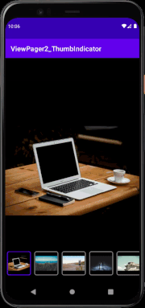
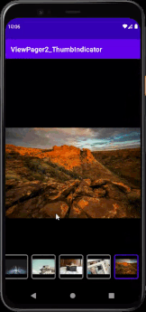

# ViewPager2-ThumbIndicator
Simple demo to showcase thumbnail indicator with viewpager2 without using any external library

&nbsp;&nbsp;&nbsp;
&nbsp;

## Important Concept :world_map:

1. Setup **Viewpager2 (image)** and **RecyclerView (thumbnail)** and load both adapter with same dataset.
2. For Viewpager2 (image), notify recyclerview to change border color and scroll to correct position when its page is selected.
```
binding.vpImage.registerOnPageChangeCallback(object: ViewPager2.OnPageChangeCallback() {
          override fun onPageSelected(position: Int) {
              super.onPageSelected(position)
              // update thumbnail border color
              thumbnailAdapter.updateSelectedPosition(position)
              // smooth scroll to corresponding position when thumbnail is outside the view
              binding.rvThumbnail.smoothScrollToPosition(position)
          }
      })
```
3. For RecyclerView (thumbnail), notify viewpager2 to change its current selected item. 
```
thumbnailAdapter = ThumbnailAdapter(imageList) {
          // when click on thumbnail, viewpager should scroll to corresponding position
          binding.vpImage.currentItem = imageList.indexOf(it)
      }
```

Cheer, now ImageViewer with its thumbnail indicator is done! :clinking_glasses:
